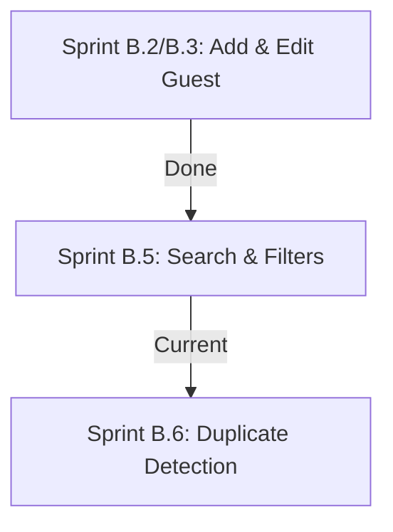

# Project RA — Technical Logbook & Audit Report

## Document Context
* **Sprint Focus**: Sprint B.5: Search & Filters
* **Project Version**: v2.2.0 (Search & Filtering Release)
* **Last Updated**: July 10, 2026
* **Objective**: Implement a fast, debounced, client-side Search & Filter panel that evaluates multiple compound criteria with active chips and clear-all actions.

---

## 1. Directory Structure Log

The folder taxonomy represents the modular layout:

| Path | Status | Target / Purpose |
| :--- | :---: | :--- |
| **`src/types/guest.ts`** | [MODIFY] | Added optional `invitationType` and appended `maybe` status. |
| **`src/repositories/GuestRepository.ts`** | [MODIFY] | Updated default mock seed records to include static `invitationType` and `relation` parameters. |
| **`src/modules/guests/Guests.tsx`** | [MODIFY] | Added search & filter panel layout, active chips, clear buttons, debouncing effects, and empty state cards. |
| **`IMPLEMENTATION_REPORT.md`** | [MODIFY] | Updated implementation logs with B.5 technical notes, debouncing, performance structures, and Firestore operations. |

---

## 2. Technical Decision Log (Sprint B.5 additions)

### Decision B.5-1: Client-Side filtering vs server queries
* **Status**: Approved
* **Context**: Minimize read costs and queries inside Firestore.
* **Decision**: Because real-time updates are established using a single sync listener subscription, we perform all search matching and compound filters locally using a React `useMemo` block.
* **Impact**: Zero database read costs for searches, no network latency, and instant roster updates.

### Decision B.5-2: Real-time debouncing
* **Status**: Approved
* **Context**: Avoid structural rebuilds of the filtered roster on every keystroke.
* **Decision**: Deployed a **250ms** timeout handler. Text queries are stored in an instant local state, but the filter memo evaluation listens to a debounced state.
* **Impact**: Silky-smooth input typing with high-performance list slicing.

---

## 3. Standardized Design Tokens & UI Guidelines

Locked in luxury dark theme styling guidelines (gold `#D4AF37`, emerald `#0F6D5B`, dark background `#090909`).

---

## 4. Verification & Server Status

* Production build `npm run build` compiled successfully (zero errors).
* Dev server handles search inputs, chip clearing, and filter adjustments instantly.

---

## 5. Sprint Planning Roadmap

