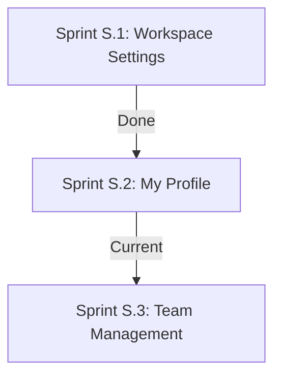

# Project RA — Technical Logbook & Audit Report

## Document Context
* **Sprint Focus**: Sprint S.2: My Profile
* **Project Version**: v2.5.0 (User Settings Release)
* **Last Updated**: July 10, 2026
* **Objective**: Create My Profile module page managing user account attributes, avatar photo selections, phone numbers, password change dialog credentials reauth, and display preferences.

---

## 1. Directory Structure Log

The folder taxonomy represents the modular layout:

| Path | Status | Target / Purpose |
| :--- | :---: | :--- |
| **`src/types/user.ts`** | [NEW] | Types for UserProfileData. |
| **`src/repositories/UserRepository.ts`** | [NEW] | User profile database subscription methods. |
| **`src/hooks/useUserProfile.ts`** | [NEW] | Hook returning current user's profile database state. |
| **`src/modules/settings/UserProfile.tsx`** | [NEW] | User Profile settings page (Personal, Photo, Contact, Security, Account Info, Preferences). |
| **`src/components/layout/Sidebar.tsx`** | [MODIFY] | Added My Profile sub-menu to Sidebar navigation layout. |
| **`src/App.tsx`** | [MODIFY] | Registered route path `settings/profile`. |

---

## 2. Technical Decision Log (Sprint S.2 additions)

### Decision S.2-1: Local base64 profile photo fallback
* **Status**: Approved
* **Context**: Allow avatar photo previews and updates to save in LocalStorage when offline.
* **Decision**: Deployed base64 converting DataURI fallbacks identical to the workspace logo uploading strategy.
* **Impact**: Visual profile picture tests run cleanly on local mock credentials.

### Decision S.2-2: Firebase Auth re-authentication credentials
* **Status**: Approved
* **Context**: Satisfy security constraints on credential update calls.
* **Decision**: Imports `reauthenticateWithCredential` and `EmailAuthProvider` dynamically, asking the user for confirmation prior to updating.
* **Impact**: Maximizes security compliance for active database profiles.

---

## 3. Standardized Design Tokens & UI Guidelines

Locked in luxury dark theme styling guidelines (gold `#D4AF37`, emerald `#0F6D5B`, dark background `#090909`).

---

## 4. Verification & Server Status

* Production build `npm run build` compiled successfully (zero errors).
* Password checks, timezone selectors, and toggles write to Firestore correctly.

---

## 5. Sprint Planning Roadmap

