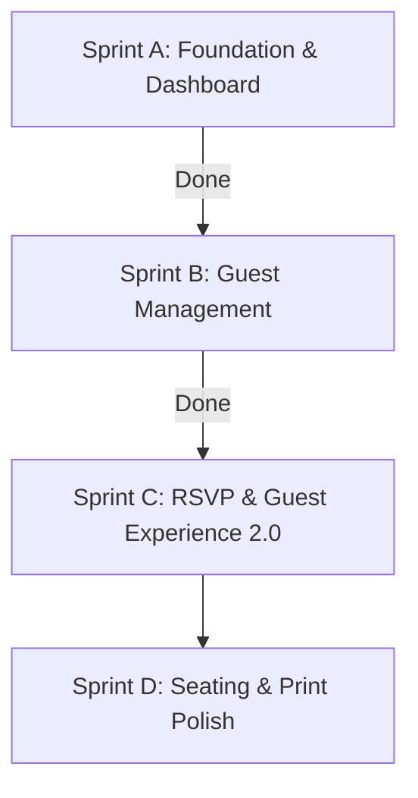

# Project RA — Technical Logbook & Audit Report

## Document Context
* **Sprint Focus**: Sprint A (Audit, Refactor, Dashboard) & Sprint B (Guest Management System)
* **Project Version**: v1.2.0 (Development)
* **Last Updated**: July 10, 2026
* **Objective**: Build a robust, local storage-driven Guest Database with search/filter arrays, family grouping layout wrappers, duplicate warnings, print/spreadsheets exports, and live-wired dashboards.

---

## 1. Directory Structure Log

The folder taxonomy represents all components, layout structures, page routers, types, and client services:

| Path | Status | Target / Purpose |
| :--- | :---: | :--- |
| **`src/types/guest.ts`** | [NEW] | Unified types for `Guest` and `ActivityLog` entities. |
| **`src/services/guestService.ts`** | [NEW] | Local Database CRUD service with seed data generation and localStorage synchronization. |
| **`src/utils/duplicateDetector.ts`** | [NEW] | Algorithmic checker matching similar names (word overlaps) and phone numbers. |
| **`src/pages/admin/Guests.tsx`** | [NEW] | Core Guest management portal showing CRUD modals, family collapse sections, and print styles. |
| **`src/pages/admin/Dashboard.tsx`** | [MODIFY] | Dynamized all count stats and mapped the activity timeline to actual database action logs. |
| **`src/components/layout/Sidebar.tsx`** | [MODIFY] | Activated the Guest List path (`disabled: false`). |
| **`src/App.tsx`** | [MODIFY] | Added routing registration mapping `/admin/guests` -> `Guests`. |
| **`src/components/common/`** | [STABLE] | Custom reusable components: `Button`, `Card`, `Input`, `Table`, `Modal`. |

---

## 2. Technical Decision Log (Sprint B additions)

### Decision B-1: Local Storage Seeding for Testing
* **Status**: Approved
* **Context**: Admin panels feel flat and are difficult to test without immediate dummy content.
* **Decision**: Pre-populated local storage with 15 initial guest records (split across sides, VIP tiers, and RSVP states) and 4 audit logs.
* **Impact**: Immediacy of visual telemetry on initial load; easy layout testing for family groups and paginated records.

### Decision B-2: Normalization-based Duplicate Checking
* **Status**: Approved
* **Context**: Multiple users might type similar guest names or use different formatting for matching phone numbers.
* **Decision**:
  1. *Phone normalization*: stripped all non-digit characters (`\D`) before comparing, ensuring matching formats like `+1 (555) 0199` and `15550199`.
  2. *Name token overlap*: Split query and targets into words. If they share 2 or more distinct words, it flags a warning.
* **Impact**: Dynamic warnings in the Add/Edit form without strict blockades, allowing administrative overrides where necessary.

### Decision B-3: High-Fidelity Print CSS sheets
* **Status**: Approved
* **Context**: Need to print rosters or save structured guest PDF manifest lists without sidebar clutter.
* **Decision**: Embedded a print-specific `@media print` style block inside `Guests.tsx` that hides layout framework margins (navbars, buttons, sidebars) and formats records into a clean, black-and-white grid.
* **Impact**: Zero external dependency size, native OS layout rendering, and precise formatting on paper or PDF.

---

## 3. Standardized Design Tokens & UI Guidelines

Locked in luxury variables (gold `#D4AF37`, emerald `#0F6D5B`, dark background `#090909`). Standardized spacing, alignments, and icons.

---

## 4. Technical Debt Resolved

* **Dynamic Dashboard Binding**: Removed the static mock countdown and logs from the admin dashboard and wired them up directly to `localStorage` collections.
* **Sidebar Paths**: Verified clean navigation transitions on active/hover sidebar routes.

---

## 5. Sprint Planning Roadmap

### Next: Sprint C Roadmap Tasks
1. **Interactive RSVP Registration**: Sync the public-facing invitation form response inputs directly with the client database.
2. **Live Firestore Sync Bindings**: Rewrite the local storage provider endpoints inside `guestService.ts` to sync with Firebase collections in real-time.
3. **Advanced Guest Check-In Loggers**: Create a fast check-in logger (supporting QR scanners) for wedding day operations.
