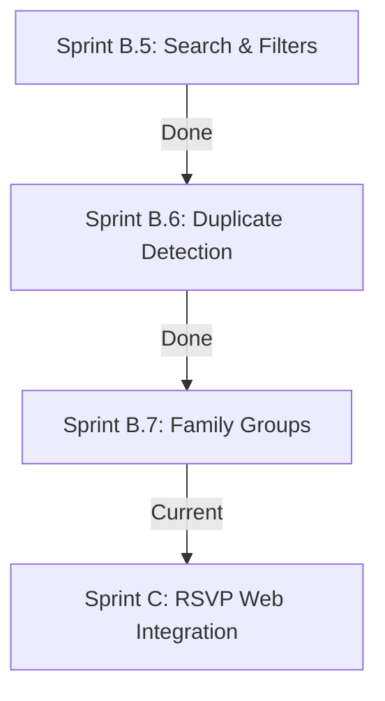

# Project RA — Technical Logbook & Audit Report

## Document Context
* **Sprint Focus**: Sprint B.7: Family Groups
* **Project Version**: v2.3.0 (Family Accordion Release)
* **Last Updated**: July 10, 2026
* **Objective**: Group guests dynamically by family name into alphabetical collapsible accordion cards with summary status widgets.

---

## 1. Directory Structure Log

The folder taxonomy represents the modular layout:

| Path | Status | Target / Purpose |
| :--- | :---: | :--- |
| **`src/modules/guests/Guests.tsx`** | [MODIFY] | Refactored flat table view into collapsible family accordion cards. Added summary KPI metrics, automatic alphabetical sorting, auto-expansion matching search, disabled actions placeholders, and custom family audit logging. |
| **`IMPLEMENTATION_REPORT.md`** | [MODIFY] | Updated implementation report details with family grouping metrics, auto-expand, and database operations. |

---

## 2. Technical Decision Log (Sprint B.7 additions)

### Decision B.7-1: Collapsed Default & State Accordion
* **Status**: Approved
* **Context**: Organize large rosters cleaner.
* **Decision**: All family group sections are collapsed by default. Clicking any card toggles its expansion state smoothly.
* **Impact**: Drastically reduced scrolling, cleaner visual design.

### Decision B.7-2: Auto-accordion Search Trigger
* **Status**: Approved
* **Context**: Avoid forcing administrators to manually open cards to search for matches.
* **Decision**: Added an effect that auto-expands all cards when the search query is active.
* **Impact**: Matches appear instantly inside expanded sections, keeping the workflow fluid.

### Decision B.7-3: Family Summary KPI blocks
* **Status**: Approved
* **Context**: High-fidelity dashboard details inside cards.
* **Decision**: Shows active guests count, total members (sum of all counts), RSVP status ratios (accepted, pending, declined, maybe), and invitation method ratios.
* **Impact**: Instant, high-fidelity administrative insights.

---

## 3. Standardized Design Tokens & UI Guidelines

Locked in luxury dark theme styling guidelines (gold `#D4AF37`, emerald `#0F6D5B`, dark background `#090909`).

---

## 4. Verification & Server Status

* Production build `npm run build` compiled successfully (zero errors).
* Accordion toggling, summary metric computations, and search auto-expansion run cleanly.

---

## 5. Sprint Planning Roadmap

